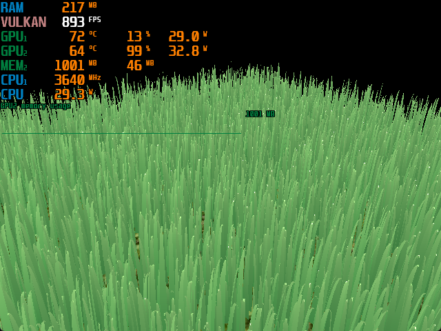
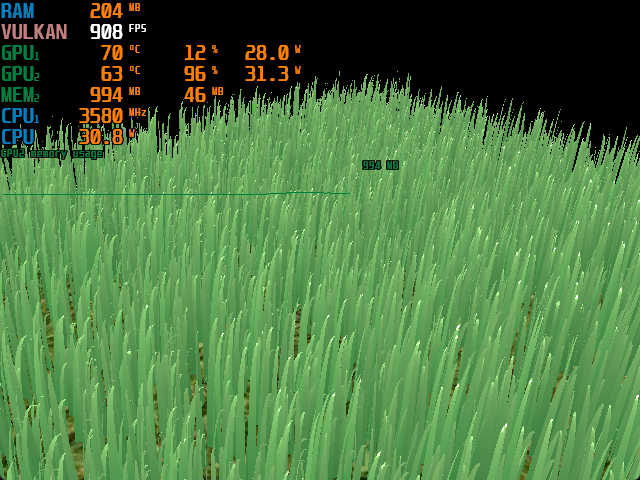

Vulkan Grass Rendering
==================================

**University of Pennsylvania, CIS 565: GPU Programming and Architecture, Project 5**

* Xiaonan Pan
  * [LinkedIn](https://www.linkedin.com/in/xiaonan-pan-9b0b0b1a7), [My Blog](www.tsingloo.com), [GitHub](https://github.com/TsingLoo)

*       | Component\Platform | Laptop              |
      | ------------------ | ------------------- |
      | OS                 | Windows 11 24H2     |
      | CPU/SoC            | AMD 7840H @ 3.8Ghz  |
      | GPU                | RTX 3050 4GB Laptop |
      | RAM                | 32GB RAM            |

# Features

##  Vulkan's Compute Shader, Tessellation Shader and Vert & Frag Shader 

This project is based on the paper, [Responsive Real-Time Grass Rendering for General 3D Scenes](https://www.cg.tuwien.ac.at/research/publications/2017/JAHRMANN-2017-RRTG/JAHRMANN-2017-RRTG-draft.pdf). It models each grass blade as a Bézier curve and computes the physical effects applied to the tip vertex, which are then propagated backward to simulate the natural motion of grass. After calculating the three control vertices, tessellation is performed to generate the final vertex positions of the curved blades for subsequent vertex and fragment shader rendering.

## Force Simulation

The physical effects include gravity, wind, and collision. A sphere is hardcoded in the compute shader to serve as the collider, and the results show that the grass interacts correctly with this virtual sphere. When the sphere pushes the grass blades down, they respond realistically and gradually bounce back to their original positions.

## Culling Tests 

| No culling             | Orientation Culling | Orientation + View-frustum culling | Orientation + View-frustum + Distance culling |
| ---------------------- | ------------------- | ---------------------------------- | --------------------------------------------- |
|  |                     |                                    |   | 

Many grass blades do not need to be rendered because they are not visible to the user. Culling these blades helps improve performance and ensures a stable and consistent rendering result.

### Orientation culling

Cull blades that are almost parallel to the viewing direction can cause unwanted aliasing artifacts, since their projected pixel width is smaller than a single pixel.

### View-frustum culling

Cull blades that lie completely outside the camera’s view frustum (based on their control points and centroid) to avoid unnecessary processing and draw calls.

### Distance culling

Cull or probabilistically fade out blades beyond a certain distance threshold. A deterministic or hash-based fading method is used to prevent visible popping artifacts.

# Performance Analysis
## FPS vs. Number of Grass Blades

*With all three culling method on and collision on*

This chart shows that renderer's performance drops exponentially as the number of grass blades increases. This is because `compute.comp` shader must run for every single blade in the scene to perform the physics and culling tests.

## FPS vs. Culling Stages 

*With 1<<12 blades and collision  on*

This chart shows that renderer's performance increases as more culling stages are included. This is because the grass rendering is GPU bottleneck. Since we use curves instead of triangulated geometry, culling the grass reduces the amount of expensive tessellation and fragment processing that needs to be performed.